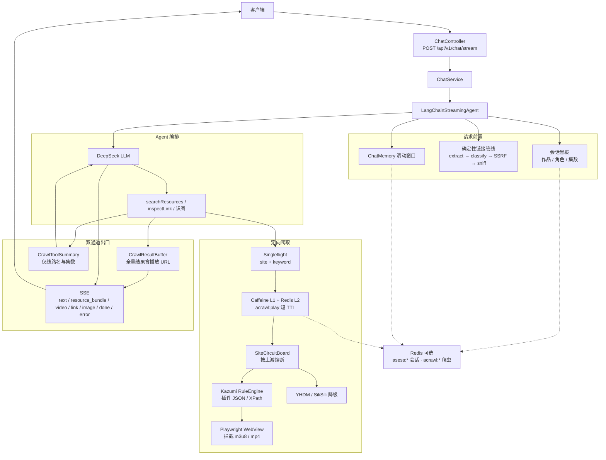
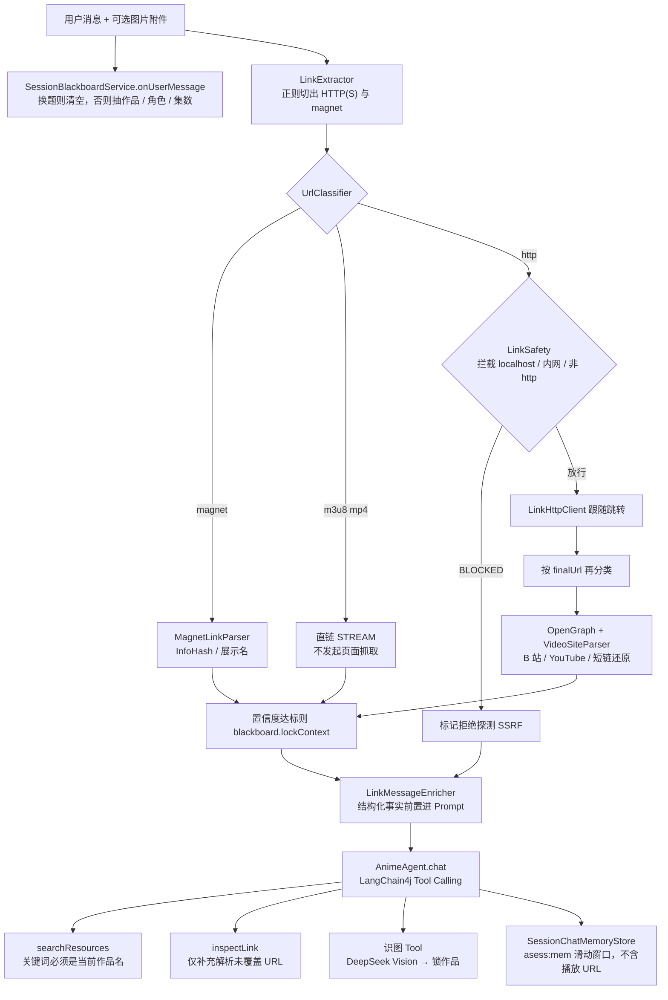
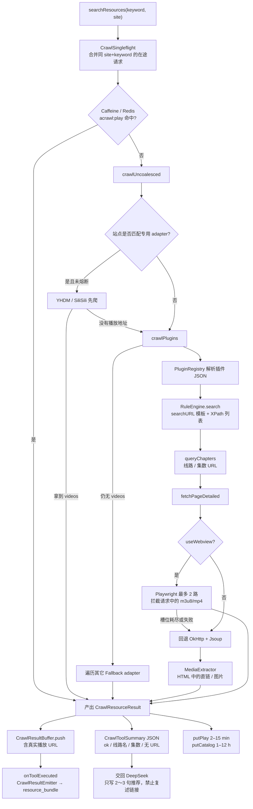
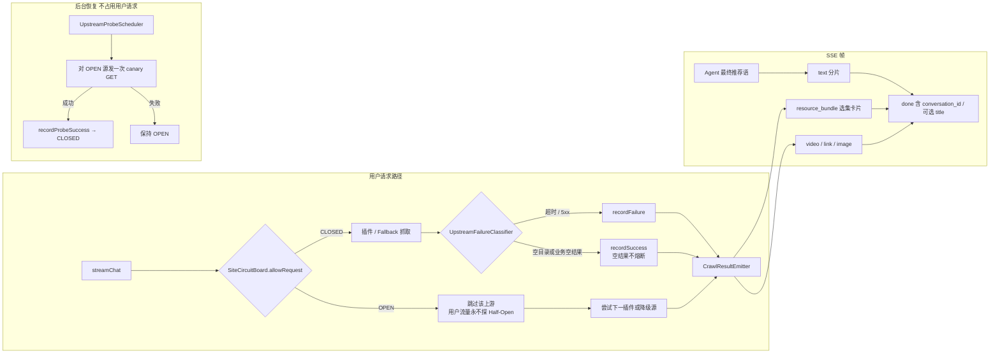
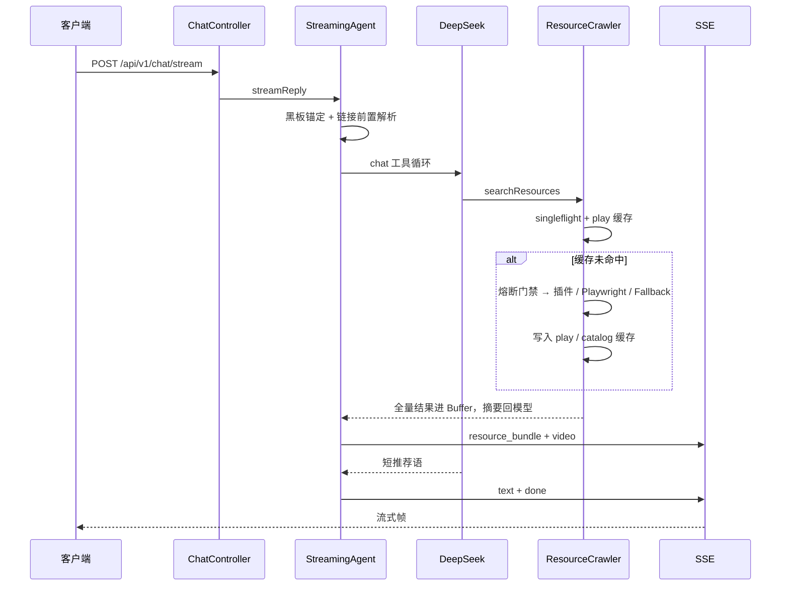

# Agent 视频资源爬取后端

该项目旨在通过自然语言对话，帮助用户在不手动翻站选源的情况下完成番剧资源检索与选集交付。后端以 SSE 流式返回按线路分组的选集卡片与短推荐语，并在源站超时或不可达时自动跳过坏源、改走其它线路。

**技术栈：** Spring Boot、LangChain4j、DeepSeek LLM、Kazumi 规则引擎、Playwright、OkHttp / Jsoup / XPath

## 总体架构

一次对话请求从 `POST /api/v1/chat/stream` 进入，先做会话锚定与确定性链接解析，再交给 LangChain4j Agent 编排工具。爬虫产出的播放 URL **不进 LLM 上下文**：全量结果走 `CrawlResultBuffer` 直推 SSE `resource_bundle`，模型只吃线路/集数摘要并写推荐语。用户消息里贴的 HTTP / magnet 走另一条确定性管线（提取 → 分类 → SSRF 拦截 → 嗅探），解析结果写入会话黑板后再注入 Prompt。



两条 URL 路径互不混用：

| 路径 | 入口 | 处理 | 播放 URL 去向 |
|------|------|------|----------------|
| 用户粘贴的链接 / magnet | `LinkInspectorService.inspectMessage` | Java 正则提取 + 分类嗅探 + SSRF 拦截 | **不爬选集**；结构化事实写入黑板并注入 Prompt |
| 站点检索出的选集 | `searchResources` → `ResourceCrawlerService` | 插件 / Playwright / 降级 adapter | 进 `CrawlResultBuffer`，由 SSE `resource_bundle` 直推前端，**禁止灌进 LLM** |

无 `DEEPSEEK_API_KEY` 时 Agent Bean 不装配，同一套爬虫走启发式检索（识别《番剧名》），链路仍可联调。

## 我的工作

### 1. 意图理解与工具编排

基于 LangChain4j 搭建多轮对话 Agent（System Prompt、滑动窗口 ChatMemory、Tool Calling），将「搜番 / 指代消歧 / 看图识番」落到 `searchResources`、`inspectLink` 等工具。

用户消息中的 HTTP(S) / magnet 由 Java **确定性提取**并分类嗅探（网页 OpenGraph、短链跳转、B 站 / YouTube、磁力 InfoHash、m3u8/mp4 直链），解析结果写入会话黑板后再注入 Prompt，避免让大模型直接抠 URL。换题检测会清空黑板；爬虫或识图成功后把作品名同步回黑板，下一轮以锚定 Prompt 开头。



数据在这一层的处理要点：

- **提取是确定性的**：`LinkExtractor` 用正则切 URL，避免 LLM 吞掉 query 或把 magnet 截断。
- **嗅探前先 SSRF**：非 http(s)、localhost、链路本地 / 站点本地地址直接 `BLOCKED`，不发请求。
- **模型看到的是事实卡片**：标题、锁定作品、集数线索、站点、InfoHash；真正的选集播放地址不经过这条路径。

### 2. 定向爬取与解析

参考 [Kazumi](https://github.com/Predidit/Kazumi) 实现站点规则引擎，用插件 JSON（`searchURL`、XPath 列表 / 章节选择器、cookie/headers）抓取搜索结果与选集；`useWebview` 站点走 Playwright 拦截 `.m3u8` / `.mp4`。插件拿不到播放地址时降级到 YHDM / SiliSili 专用 adapter。

爬取结果清洗为 `resource_bundle`（标题、线路、集数、可播链接），LLM 只吃摘要，播放 URL 不灌进上下文。同 `site + keyword` 的并发请求在缓存查找外层做单飞合并；播放结果写入短 TTL 缓存（默认 10 分钟，硬顶 15 分钟，适配带 `X-Amz-Expires` 的签名直链），目录快照另存长 TTL（默认 8 小时）。



缓存与会话键前缀隔离：爬虫 `acrawl:play` / `acrawl:catalog`，会话 `asess:meta` / `asess:board` / `asess:mem`。Redis 不可用时读写失败留在本地，不让一次缓存故障打垮检索。

### 3. 流式交付与可靠性

实现会话创建与 `POST /api/v1/chat/stream` SSE 推流（`text` / `resource_bundle` / `video` / `link` / `image` / `done` / `error`）。

按上游做熔断（1 分钟内多次超时或 5xx 则跳过该源）、同 `site + keyword` 单飞合并爬取、Playwright 全局最多 2 路并发，挤不进去回退 OkHttp；后台定时对熔断源做 canary 嗅探，探测不走用户请求路径。无 `DEEPSEEK_API_KEY` 时降级为启发式检索，保证链路可联调。



一次成功搜番在时间线上的数据流：



## 快速启动

```bash
cp .env.example .env   # 填入 DEEPSEEK_API_KEY
export $(grep -v '^#' .env | xargs)
mvn spring-boot:run
```

默认 `http://localhost:8000`。首次使用 Playwright WebView 需安装 Chromium：

```bash
mvn exec:java -Dexec.args="install chromium"
```

| 方法 | 路径 | 说明 |
|------|------|------|
| `POST` | `/api/v1/conversations` | 创建会话 |
| `POST` | `/api/v1/chat/stream` | 发送消息，SSE 流式返回 |

未配置 API Key 时仍可联调启发式检索（识别《番剧名》）。单元测试默认关闭 WebView / 熔断嗅探 / Redis。

```bash
mvn test
```

## 文档

| 文档 | 说明 |
|------|------|
| [接口文档](docs/接口文档.md) | SSE 协议、资源块、`resource_bundle` 选集卡片、上传与多模态 |
| [会话标题](docs/会话标题.md) | 首轮 `need_title` / `done.title` |
| [联调指南](docs/联调指南.md) | 启动、三条主路径、常见问题 |

## 目录

```
src/main/java/com/agentcrawler/
├── api/                 # REST / SSE
├── agent/langchain/     # LangChain4j Agent 与 Tool
├── agent/session/       # 会话黑板（作品 / 角色 / 集数锚定）
├── crawler/
│   ├── engine/          # Kazumi 风格规则引擎
│   ├── plugin/          # 站点插件 JSON
│   ├── webview/         # Playwright（useWebview）
│   ├── fallback/        # YHDM / SiliSili 降级
│   ├── reliability/     # 熔断、单飞、后台嗅探
│   └── cache/           # 爬虫出口缓存（播放短 TTL / 目录长 TTL）
├── link/                # URL / magnet 确定性解析
├── streaming/           # SSE 编码
└── store/               # 会话 meta / ChatMemory（可选 Redis）
```

站点规则：`src/main/resources/plugins/*.json`。

## 环境变量

| 变量 | 说明 | 默认 |
|------|------|------|
| `DEEPSEEK_API_KEY` | DeepSeek API Key（启用完整 Agent / 识图） | 空 |
| `DEEPSEEK_BASE_URL` | OpenAI 兼容地址 | `https://api.deepseek.com/v1` |
| `AGENT_PUBLIC_BASE_URL` | 上传图片对外 URL | `http://localhost:8000` |
| `AGENT_REDIS_ENABLED` | Redis（爬虫缓存 L2 + 会话持久化） | `false` |
