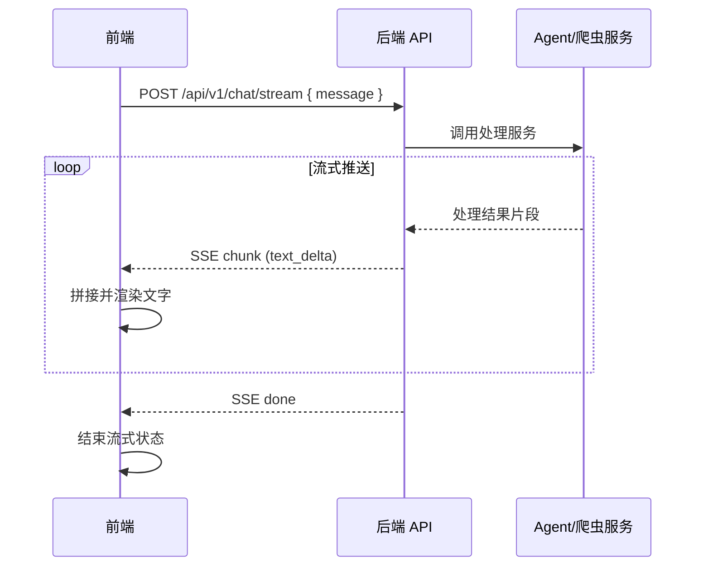

# 对话与流式响应接口文档

> 文档版本：v1.0  
> 更新日期：2026-09-03  
> 适用范围：Agent Crawler 后端 ↔ 前端  
> 当前实现阶段：**文字流式输出**（`text_delta`）；图片、链接标签流式输出已预留协议，后续迭代实现。

---

## 1. 概述

Agent Crawler 的对话流程分为两步：

1. **用户发起对话**：前端将用户消息发送至后端。
2. **服务端处理并流式返回**：后端调用 Agent / 爬虫服务处理请求，将结果以 **SSE（Server-Sent Events）** 流式推送给前端。

前端按块（chunk）增量渲染：

| 块类型 | 状态 | 说明 |
|--------|------|------|
| `text_delta` | ✅ 已实现 | 文字增量，前端逐字/逐段拼接显示 |
| `image` | 🔜 预留 | 图片资源 URL |
| `link` | 🔜 预留 | 可点击的链接标签 |
| `done` | ✅ 已实现 | 流结束，返回消息与会话 ID |
| `error` | ✅ 已实现 | 错误信息 |

---

## 2. 通用约定

### 2.1 Base URL

| 环境 | 地址 |
|------|------|
| 开发 | `http://localhost:8000`（Vite 通过 `/api` 代理转发） |
| 生产 | 由部署环境配置，前端通过 `VITE_API_BASE_URL` 注入 |

### 2.2 请求头

| Header | 值 | 说明 |
|--------|-----|------|
| `Content-Type` | `application/json` | JSON 请求体 |
| `Accept` | `text/event-stream` | 流式接口必填 |

### 2.3 响应格式

- 普通接口：`application/json`
- 流式接口：`text/event-stream`（SSE）

### 2.4 错误码（HTTP 层）

| HTTP 状态码 | 说明 |
|-------------|------|
| 200 | 成功（流式接口表示连接建立成功） |
| 400 | 请求参数错误 |
| 401 | 未授权 |
| 429 | 请求过于频繁 |
| 500 | 服务端内部错误 |
| 503 | Agent 服务不可用 |

业务错误在 SSE 流内通过 `error` 事件返回（见 §4.3）。

---

## 3. 创建会话

可选接口。若前端未传 `conversation_id`，后端可在首次对话时自动创建会话。

### 3.1 基本信息

| 项目 | 值 |
|------|-----|
| 方法 | `POST` |
| 路径 | `/api/v1/conversations` |
| 说明 | 创建一个新的对话会话 |

### 3.2 请求体

```json
{}
```

### 3.3 响应体

```json
{
  "conversation_id": "conv_01HXYZABCDEF",
  "created_at": "2026-09-03T09:00:00Z"
}
```

| 字段 | 类型 | 说明 |
|------|------|------|
| `conversation_id` | `string` | 会话唯一标识，后续对话需携带 |
| `created_at` | `string` | ISO 8601 创建时间 |

### 3.4 示例

```bash
curl -X POST http://localhost:8000/api/v1/conversations \
  -H "Content-Type: application/json"
```

---

## 4. 发送对话消息（流式）

核心接口。用户发送一条消息后，服务端调用 Agent 处理，并以 SSE 流式返回处理结果。

### 4.1 基本信息

| 项目 | 值 |
|------|-----|
| 方法 | `POST` |
| 路径 | `/api/v1/chat/stream` |
| Content-Type | `application/json` |
| Accept | `text/event-stream` |
| 说明 | 发送用户消息，流式返回 Agent 处理结果 |

### 4.2 请求体

```json
{
  "conversation_id": "conv_01HXYZABCDEF",
  "message": "帮我爬取这个番剧的播放链接：https://example.com/anime/123"
}
```

| 字段 | 类型 | 必填 | 说明 |
|------|------|------|------|
| `message` | `string` | ✅ | 用户输入内容，支持多行文本 |
| `conversation_id` | `string` | ❌ | 会话 ID；省略时后端自动创建新会话 |

### 4.3 SSE 事件格式

响应为 **SSE 流**，每帧由空行分隔，包含 `event` 与 `data` 两行：

```
event: chunk
data: {"type":"text_delta","content":"正在"}

event: chunk
data: {"type":"text_delta","content":"分析"}

event: chunk
data: {"type":"text_delta","content":"目标页面..."}

event: done
data: {"type":"done","message_id":"msg_01HXYZ","conversation_id":"conv_01HXYZABCDEF"}
```

#### 4.3.1 事件类型一览

| SSE event | data.type | 状态 | 说明 |
|-----------|-----------|------|------|
| `chunk` | `text_delta` | ✅ 当前实现 | 文字增量块 |
| `chunk` | `image` | 🔜 预留 | 图片块 |
| `chunk` | `link` | 🔜 预留 | 链接块 |
| `done` | `done` | ✅ | 流正常结束 |
| `error` | `error` | ✅ | 流异常结束 |

---

### 4.4 数据块详细定义

#### 4.4.1 `text_delta` — 文字增量（当前实现）

前端将多次 `content` **顺序拼接** 为完整回复文本。

```json
{
  "type": "text_delta",
  "content": "部分文字"
}
```

| 字段 | 类型 | 说明 |
|------|------|------|
| `type` | `"text_delta"` | 固定值 |
| `content` | `string` | 本次增量文字，可为单字符、词或句 |

**后端建议：**

- 按 Token 或句子切分推送，单块建议不超过 512 字符。
- 保持 UTF-8 编码，避免在多字节字符中间切断。
- 推送顺序即为前端展示顺序。

**前端处理逻辑：**

```typescript
if (chunk.type === 'text_delta') {
  assistantMessage.content += chunk.content
}
```

---

#### 4.4.2 `image` — 图片块（预留，暂未实现）

后续用于流式返回采集到的图片资源。

```json
{
  "type": "image",
  "url": "https://cdn.example.com/images/poster.jpg",
  "alt": "番剧封面"
}
```

| 字段 | 类型 | 说明 |
|------|------|------|
| `type` | `"image"` | 固定值 |
| `url` | `string` | 图片地址 |
| `alt` | `string` | 可选，替代文本 |

---

#### 4.4.3 `link` — 链接块（预留，暂未实现）

后续用于流式返回可点击的资源链接标签。

```json
{
  "type": "link",
  "url": "https://example.com/play/123",
  "title": "第 1 集播放页",
  "description": "1080P 在线播放"
}
```

| 字段 | 类型 | 说明 |
|------|------|------|
| `type` | `"link"` | 固定值 |
| `url` | `string` | 链接地址 |
| `title` | `string` | 展示标题 |
| `description` | `string` | 可选，副标题或摘要 |

---

#### 4.4.4 `done` — 流结束

表示本次对话处理完成，**必须发送**。

```json
{
  "type": "done",
  "message_id": "msg_01HXYZABCDEF",
  "conversation_id": "conv_01HXYZABCDEF"
}
```

| 字段 | 类型 | 说明 |
|------|------|------|
| `type` | `"done"` | 固定值 |
| `message_id` | `string` | 本次助手回复的消息 ID |
| `conversation_id` | `string` | 会话 ID（新建会话时返回新 ID） |

---

#### 4.4.5 `error` — 错误

处理失败时发送，发送后应关闭 SSE 连接。

```json
{
  "type": "error",
  "code": "AGENT_TIMEOUT",
  "message": "Agent 处理超时，请稍后重试"
}
```

| 字段 | 类型 | 说明 |
|------|------|------|
| `type` | `"error"` | 固定值 |
| `code` | `string` | 业务错误码 |
| `message` | `string` | 用户可读错误信息 |

**建议错误码：**

| code | 说明 |
|------|------|
| `INVALID_REQUEST` | 请求参数不合法 |
| `CONVERSATION_NOT_FOUND` | 会话不存在 |
| `AGENT_TIMEOUT` | Agent 处理超时 |
| `AGENT_ERROR` | Agent 内部错误 |
| `CRAWL_FAILED` | 爬虫执行失败 |
| `RATE_LIMITED` | 触发限流 |

SSE 帧示例：

```
event: error
data: {"type":"error","code":"AGENT_TIMEOUT","message":"Agent 处理超时，请稍后重试"}
```

---

## 5. 完整流式交互示例

### 5.1 请求

```bash
curl -N -X POST http://localhost:8000/api/v1/chat/stream \
  -H "Content-Type: application/json" \
  -H "Accept: text/event-stream" \
  -d '{
    "conversation_id": "conv_01HXYZABCDEF",
    "message": "帮我找《葬送的芙莉莲》的播放资源"
  }'
```

### 5.2 响应（SSE 流）

```
event: chunk
data: {"type":"text_delta","content":"好的，"}

event: chunk
data: {"type":"text_delta","content":"正在为你检索"}

event: chunk
data: {"type":"text_delta","content":"《葬送的芙莉莲》相关资源...\n\n"}

event: chunk
data: {"type":"text_delta","content":"已找到 3 个可用来源。"}

event: done
data: {"type":"done","message_id":"msg_01HXYZABCDEF","conversation_id":"conv_01HXYZABCDEF"}
```

### 5.3 前端最终渲染效果

```
好的，正在为你检索《葬送的芙莉莲》相关资源...

已找到 3 个可用来源。
```

---

## 6. 时序图



---

## 7. 前端对接说明

### 7.1 相关源码

| 文件 | 职责 |
|------|------|
| `src/types/chat.ts` | 流式块 TypeScript 类型定义 |
| `src/utils/sse.ts` | SSE 流解析器 |
| `src/api/chat.ts` | 对话 API 客户端 |
| `src/pages/ChatPage.vue` | 聊天页，消费 `text_delta` 流式渲染 |

### 7.2 环境变量

| 变量 | 说明 | 开发默认值 |
|------|------|-----------|
| `VITE_API_BASE_URL` | API 根地址，空则使用相对路径 `/api` | 空 |
| `VITE_USE_MOCK_STREAM` | 无后端时启用 Mock 流 | `true` |

### 7.3 Mock 模式

开发阶段若后端未就绪，设置 `VITE_USE_MOCK_STREAM=true`，前端将模拟与本文档一致的 `text_delta` + `done` 流式输出，便于联调前自测 UI。

联调后端时改为：

```env
VITE_USE_MOCK_STREAM=false
```

---

## 8. 后续迭代计划

| 阶段 | 内容 |
|------|------|
| v1.0（当前） | 文字 `text_delta` 流式输出 |
| v1.1 | `image` 图片块流式渲染 |
| v1.2 | `link` 链接标签流式渲染 |
| v1.3 | 会话历史查询、消息重试 |

---

## 9. 变更记录

| 日期 | 版本 | 说明 |
|------|------|------|
| 2026-09-03 | v1.0 | 初版：对话接口 + 文字流式输出协议 |
