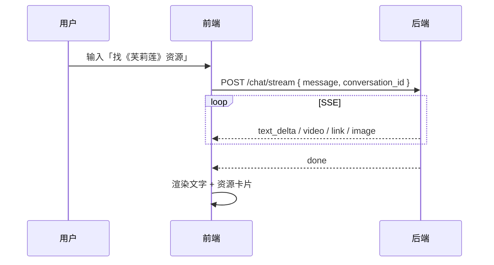
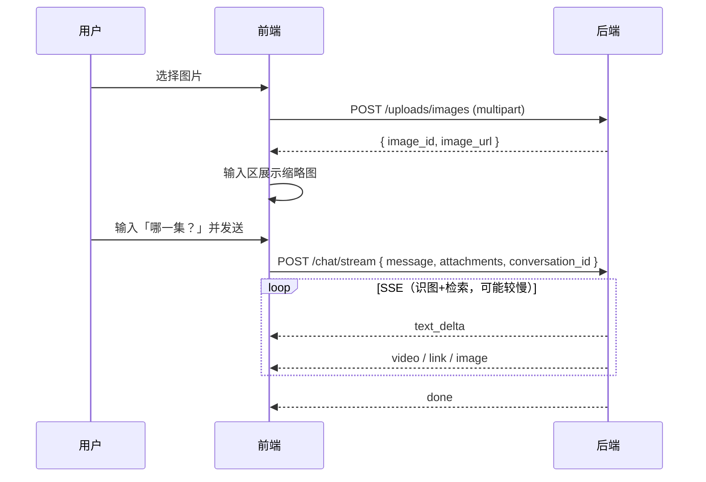

# 前端适配指南（v1.2 多模态 + 资源块汇总）

> 文档版本：**v1.2**  
> 更新日期：2026-09-07  
> 适用范围：Agent Crawler 后端 ↔ 前端  
> 关联文档：  
> - `2026-09-03_接口文档_1.md`（v1.0 基础对话 / SSE 协议）  
> - `2026-09-04_接口文档_2.md`（v1.1 资源块 video / link / image）

---

## 1. 前端适配总览（截止当前后端能力）

| 优先级 | 模块 | 是否必须 | 说明 |
|--------|------|----------|------|
| P0 | SSE 基础协议 | ✅ | `text_delta` + `done` + `error`（v1.0） |
| P0 | 多轮会话 | ✅ | 同一 `conversation_id` 贯穿多轮对话 |
| P0 | 资源块渲染 | ✅ | `video` / `link` / `image`（v1.1） |
| P0 | 图片上传 | ✅ **v1.2 新增** | 发图前先调上传接口 |
| P0 | 带附件对话 | ✅ **v1.2 新增** | `chat/stream` 请求体增加 `attachments` |
| P1 | 用户发图预览 | 建议 | 上传后在输入区展示缩略图 |
| P1 | 识图进度提示 | 建议 | 流式阶段展示 loading（识图 + 检索可能较慢） |
| P2 | Mock 多模态 | 可选 | Mock 暂不支持 attachments，联调真实后端时需关闭 |

> **黑板 / 实体锚定 / Vision Tool 均为后端内部逻辑，前端无需额外接口。**  
> 前端只需：上传图片 → 带 `attachments` 发消息 → 消费 SSE 流。

---

## 2. 通用约定

### 2.1 Base URL

| 环境 | 地址 |
|------|------|
| 开发 | `http://localhost:8000`（Vite 代理 `/api` → 后端） |
| 生产 | 由 `VITE_API_BASE_URL` 或部署环境注入 |

健康检查：`GET /health` → `{ "status": "ok" }`

### 2.2 JSON 字段命名

后端统一使用 **snake_case**（如 `conversation_id`、`image_url`）。

### 2.3 请求头

| 接口类型 | Content-Type | Accept |
|----------|--------------|--------|
| JSON 接口 | `application/json` | `application/json` |
| 上传图片 | `multipart/form-data` | `application/json` |
| 流式对话 | `application/json` | `text/event-stream` |

### 2.4 环境变量（前端）

```env
VITE_USE_MOCK_STREAM=false
VITE_API_BASE_URL=
```

联调真实后端时 **必须** `VITE_USE_MOCK_STREAM=false`，否则拿不到 `video/link/image` 及多模态能力。

---

## 3. 接口清单

| 方法 | 路径 | 版本 | 说明 |
|------|------|------|------|
| `POST` | `/api/v1/conversations` | v1.0 | 创建会话（可选） |
| `POST` | `/api/v1/chat/stream` | v1.0/v1.1/v1.2 | 发送消息，SSE 流式返回 |
| `POST` | `/api/v1/uploads/images` | **v1.2** | 上传用户图片 |
| `GET` | `/api/v1/files/images/{image_id}` | **v1.2** | 获取已上传图片（预览/识图用） |

---

## 4. 创建会话（v1.0，可选）

### 4.1 请求

```http
POST /api/v1/conversations
Content-Type: application/json
```

请求体：`{}` 或省略 body。

### 4.2 响应

```json
{
  "conversation_id": "conv_a1b2c3d4e5f6",
  "created_at": "2026-09-07T03:00:00Z"
}
```

### 4.3 前端策略

- **推荐**：进入聊天页时调用一次，缓存 `conversation_id` 到本地状态 / localStorage。
- **可省略**：首次 `chat/stream` 不传 `conversation_id` 时，后端会自动创建并在 `done` 事件中返回新 ID。
- **多轮关键**：后续每一轮请求 **必须携带同一 `conversation_id`**，否则后端无法维持 Agent 记忆与实体锚点。

---

## 5. 上传图片（v1.2 新增）

用户发送表情包 / 截图前，**必须先上传**，再将返回的 `image_id` 或 `image_url` 放入对话 `attachments`。

### 5.1 请求

```http
POST /api/v1/uploads/images
Content-Type: multipart/form-data
```

| 字段 | 类型 | 必填 | 说明 |
|------|------|------|------|
| `file` | `File` | ✅ | 图片文件 |

**支持格式**：JPEG、PNG、GIF、WebP  
**大小限制**：单文件最大 **32 MB**

### 5.2 成功响应（200）

```json
{
  "image_id": "img_a1b2c3d4e5f6",
  "image_url": "http://localhost:8000/api/v1/files/images/img_a1b2c3d4e5f6",
  "mime_type": "image/png",
  "size": 102400
}
```

| 字段 | 类型 | 说明 |
|------|------|------|
| `image_id` | `string` | 图片唯一 ID，可用于 `attachments` |
| `image_url` | `string` | 后端可访问的完整 URL，可用于预览与 `attachments` |
| `mime_type` | `string` | MIME 类型 |
| `size` | `number` | 字节数 |

### 5.3 失败响应（JSON，非 SSE）

```json
{
  "code": "UPLOAD_FAILED",
  "message": "仅支持 JPEG/PNG/GIF/WebP 图片"
}
```

| HTTP | code | 说明 |
|------|------|------|
| 400 | `INVALID_REQUEST` | 未选择文件 |
| 500 | `UPLOAD_FAILED` | 格式不支持 / 超过大小 / 保存失败 |

### 5.4 获取图片（预览）

```http
GET /api/v1/files/images/{image_id}
```

返回图片二进制，`Content-Type` 为对应 MIME。可用于：

- 聊天输入区缩略图：``
- 用户消息气泡内展示原图

### 5.5 前端上传示例

```typescript
async function uploadChatImage(file: File): Promise<ImageUploadResponse> {
  const form = new FormData()
  form.append('file', file)

  const res = await fetch('/api/v1/uploads/images', {
    method: 'POST',
    body: form,
  })

  if (!res.ok) {
    const err = await res.json()
    throw new Error(err.message ?? '上传失败')
  }
  return res.json()
}
```

---

## 6. 发送对话消息（流式，v1.2 扩展）

### 6.1 基本信息

```http
POST /api/v1/chat/stream
Content-Type: application/json
Accept: text/event-stream
```

### 6.2 请求体

#### 6.2.1 纯文本（与 v1.0 兼容）

```json
{
  "conversation_id": "conv_a1b2c3d4e5f6",
  "message": "帮我找《葬送的芙莉莲》的播放资源"
}
```

#### 6.2.2 带图片附件（v1.2）

```json
{
  "conversation_id": "conv_a1b2c3d4e5f6",
  "message": "这张表情包出自哪一集？",
  "attachments": [
    {
      "type": "image",
      "image_id": "img_a1b2c3d4e5f6"
    }
  ]
}
```

或使用完整 URL：

```json
{
  "conversation_id": "conv_a1b2c3d4e5f6",
  "message": "帮我识别并找资源",
  "attachments": [
    {
      "type": "image",
      "image_url": "http://localhost:8000/api/v1/files/images/img_a1b2c3d4e5f6"
    }
  ]
}
```

#### 6.2.3 仅图片、无文字（v1.2）

```json
{
  "conversation_id": "conv_a1b2c3d4e5f6",
  "message": "",
  "attachments": [
    { "type": "image", "image_id": "img_a1b2c3d4e5f6" }
  ]
}
```

`message` 为空但存在 `attachments` 时合法；后端会自动补默认文案「请分析这张图片并告诉我出处。」

#### 6.2.4 字段说明

| 字段 | 类型 | 必填 | 说明 |
|------|------|------|------|
| `message` | `string` | 条件必填 | 用户文字；与 `attachments` 至少一项非空 |
| `conversation_id` | `string` | ❌ | 会话 ID；省略则自动创建 |
| `attachments` | `array` | ❌ | 附件列表，默认 `[]` |

**`attachments[]` 元素：**

| 字段 | 类型 | 必填 | 说明 |
|------|------|------|------|
| `type` | `string` | ❌ | 默认 `"image"` |
| `image_id` | `string` | 二选一 | 上传接口返回的 ID |
| `image_url` | `string` | 二选一 | 上传接口返回的 URL |

> 每个附件需提供 `image_id` **或** `image_url`（推荐优先用 `image_id`，由前端统一拼 URL 亦可）。

### 6.3 后端处理流程（供前端理解等待时长）

```
用户消息 + attachments
    → Agent 调用 analyzeAnimeImage(image_url)  [DeepSeek Vision]
    → 自动锁定作品上下文（后端内部）
    → Agent 调用 searchResources(keyword)      [爬虫]
    → SSE 推送 text_delta + video/link/image
    → done
```

识图 + 检索可能 **数十秒**，前端请：

- 禁用重复发送
- 展示 streaming / loading 状态
- 超时建议 ≥ 120s（与后端 Agent 超时一致）

---

## 7. SSE 流式响应（v1.0 + v1.1 + v1.2 汇总）

### 7.1 帧格式

每帧由空行分隔：

```
event: chunk
data: {"type":"text_delta","content":"..."}

event: done
data: {"type":"done","message_id":"msg_xxx","conversation_id":"conv_xxx"}
```

### 7.2 块类型一览

| data.type | SSE event | 版本 | 前端处理 |
|-----------|-----------|------|----------|
| `text_delta` | `chunk` | v1.0 | 拼接到助手正文 |
| `video` | `chunk` | v1.1 | 推入 `videos[]`，渲染播放卡片 |
| `link` | `chunk` | v1.1 | 推入 `links[]`，渲染链接列表 |
| `image` | `chunk` | v1.1 | 推入 `images[]`，渲染缩略图（**爬虫结果图，非用户上传图**） |
| `done` | `done` | v1.0 | 结束流，保存 `message_id` |
| `error` | `error` | v1.0 | 展示错误，结束流 |

> v1.2 **未新增**独立 `vision_result` SSE 块。识图结果以 `text_delta` 文本（如 Agent 回复 + `[视觉识别完成]`）呈现；结构化识图数据由后端写入会话黑板，不暴露给前端。

### 7.3 TypeScript 类型（完整版）

```typescript
/** 上传接口响应 */
export interface ImageUploadResponse {
  image_id: string
  image_url: string
  mime_type: string
  size: number
}

/** 对话附件 */
export interface ChatAttachment {
  type?: 'image'
  image_id?: string
  image_url?: string
}

/** 对话请求 */
export interface ChatStreamRequest {
  message: string
  conversation_id?: string
  attachments?: ChatAttachment[]
}

/** SSE 流块 */
export type StreamChunk =
  | { type: 'text_delta'; content: string }
  | {
      type: 'video'
      url: string
      title: string
      format?: 'm3u8' | 'mp4' | 'unknown'
      source_page?: string
      road_name?: string
    }
  | {
      type: 'link'
      url: string
      title: string
      description?: string
    }
  | {
      type: 'image'
      url: string
      alt?: string
    }
  | { type: 'done'; message_id: string; conversation_id: string }
  | { type: 'error'; code: string; message: string }

/** 助手消息（推荐结构） */
export interface AssistantMessage {
  id?: string
  role: 'assistant'
  content: string
  videos: Extract<StreamChunk, { type: 'video' }>[]
  links: Extract<StreamChunk, { type: 'link' }>[]
  images: Extract<StreamChunk, { type: 'image' }>[]
  streaming: boolean
}

/** 用户消息（推荐结构） */
export interface UserMessage {
  id?: string
  role: 'user'
  content: string
  /** 用户上传的原图，用于气泡展示 */
  uploadedImages?: { image_id: string; image_url: string }[]
}
```

### 7.4 资源块字段（v1.1 摘要）

#### `video`

```json
{
  "type": "video",
  "url": "https://cdn.example.com/ep1/index.m3u8",
  "title": "第1集",
  "format": "m3u8",
  "source_page": "https://site.example.com/play/1",
  "road_name": "线路1"
}
```

- `format=m3u8` 时需 HLS 播放器（hls.js 等）

#### `link`

```json
{
  "type": "link",
  "url": "https://site.example.com/detail/123",
  "title": "葬送的芙莉莲",
  "description": "搜索结果"
}
```

#### `image`（爬虫返回的封面/海报，非用户上传）

```json
{
  "type": "image",
  "url": "https://cdn.example.com/poster.jpg",
  "alt": "葬送的芙莉莲"
}
```

### 7.5 错误码（SSE `error` 事件）

| code | 说明 | 前端建议 |
|------|------|----------|
| `INVALID_REQUEST` | 参数非法（如 message 与 attachments 皆空） | 检查输入 |
| `CONVERSATION_NOT_FOUND` | 会话不存在 | 重新 `POST /conversations` |
| `AGENT_TIMEOUT` | Agent 超时（>120s） | 提示重试 |
| `AGENT_ERROR` | Agent 内部错误 | 通用错误 Toast |
| `CRAWL_FAILED` | 爬虫失败 | 保留已有 text，提示换关键词 |
| `VISION_FAILED` | 视觉识别失败 | 提示换清晰图片重试 |
| `UPLOAD_FAILED` | 上传失败（HTTP 层已返回，一般不会进 SSE） | — |
| `RATE_LIMITED` | 限流 | 稍后重试 |

---

## 8. 推荐前端交互流程

### 8.1 纯文本搜资源



### 8.2 图片识图 + 搜资源（v1.2）



### 8.3 多轮追问（同一作品）

第二轮起 **只需 text**，无需重复上传图片，但 **必须同一 `conversation_id`**：

```json
{
  "conversation_id": "conv_xxx",
  "message": "那这一集最后打赢了吗？"
}
```

后端会通过内部实体黑板保持「当前锁定作品」，前端无额外字段。

---

## 9. 前端改造 Checklist

### 9.1 API 层（`src/api/chat.ts` 等）

- [ ] 新增 `uploadImage(file: File): Promise<ImageUploadResponse>`
- [ ] `streamChat` 请求体增加可选 `attachments`
- [ ] 确保 `Accept: text/event-stream`
- [ ] 首次响应后从 `done.conversation_id` 持久化会话 ID

### 9.2 SSE 解析（`src/utils/sse.ts`）

- [ ] 分支处理 `video` / `link` / `image`（v1.1）
- [ ] 处理 `done` / `error`
- [ ] 不要将所有 `chunk` 当作 `text_delta`

### 9.3 聊天页 UI（`ChatPage.vue` 等）

- [ ] 图片选择按钮 + 上传进度
- [ ] 用户消息气泡：展示 `uploadedImages` 缩略图 + 文字
- [ ] 助手消息：分区渲染 `content` / `videos` / `links` / `images`
- [ ] 流式中禁用发送按钮；超时友好提示
- [ ] m3u8 播放能力（或降级为打开 `source_page`）

### 9.4 类型（`src/types/chat.ts`）

- [ ] 采用 §7.3 完整类型定义

### 9.5 联调配置

- [ ] `VITE_USE_MOCK_STREAM=false`
- [ ] Vite 代理 `/api` → `http://localhost:8000`
- [ ] 后端配置 `DEEPSEEK_API_KEY`（否则无 Agent / 识图能力，仅启发式文本检索）

---

## 10. 完整请求示例

### 10.1 上传 + 识图对话

```bash
# 1. 上传
curl -X POST http://localhost:8000/api/v1/uploads/images \
  -F "file=@meme.png"

# 响应: {"image_id":"img_xxx","image_url":"http://localhost:8000/api/v1/files/images/img_xxx",...}

# 2. 流式对话
curl -N -X POST http://localhost:8000/api/v1/chat/stream \
  -H "Content-Type: application/json" \
  -H "Accept: text/event-stream" \
  -d '{
    "conversation_id": "conv_xxx",
    "message": "这张表情包出自哪一集？",
    "attachments": [{"type":"image","image_id":"img_xxx"}]
  }'
```

### 10.2 纯文本检索（v1.1 资源块）

```bash
curl -N -X POST http://localhost:8000/api/v1/chat/stream \
  -H "Content-Type: application/json" \
  -H "Accept: text/event-stream" \
  -d '{"message":"帮我找《葬送的芙莉莲》的播放资源"}'
```

---

## 11. 注意事项

1. **不要把图片 base64 放进 `message`**：后端 Agent 只接受 URL；base64 仅在后端 Vision 子调用内部使用。
2. **用户上传图 vs 爬虫结果图**：  
   - 用户上传 → `POST /uploads/images` + 用户气泡预览  
   - 爬虫返回 → SSE `type: "image"` 块，渲染在助手回复区
3. **CORS**：开发环境后端已允许 `localhost:5173`；生产需配置实际前端域名。
4. **生产环境 `image_url`**：部署时需设置后端 `AGENT_PUBLIC_BASE_URL` 为公网地址，否则返回的 URL 可能仅内网可用。
5. **Mock 模式**：无法模拟上传与识图；多模态联调必须接真实后端。

---

## 12. 变更记录

| 日期 | 版本 | 说明 |
|------|------|------|
| 2026-09-07 | **v1.2** | 新增图片上传接口、`attachments` 字段、多模态对话流程说明；汇总 v1.0~v1.2 前端 Checklist |
| 2026-09-04 | v1.1 | 启用 video/link/image SSE 资源块 |
| 2026-09-03 | v1.0 | 初版对话 + text_delta 流式协议 |
