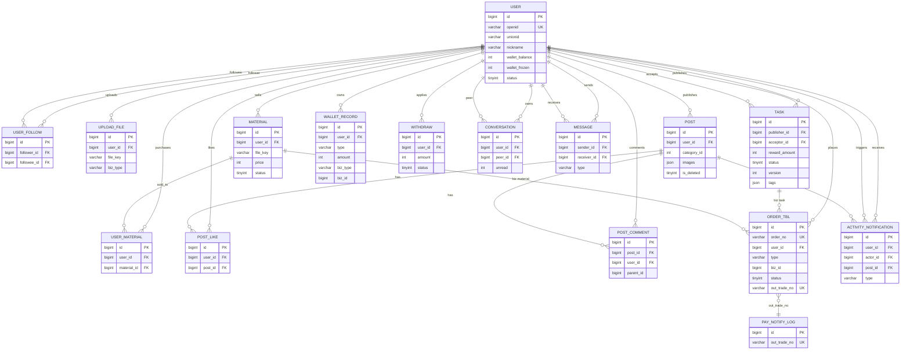
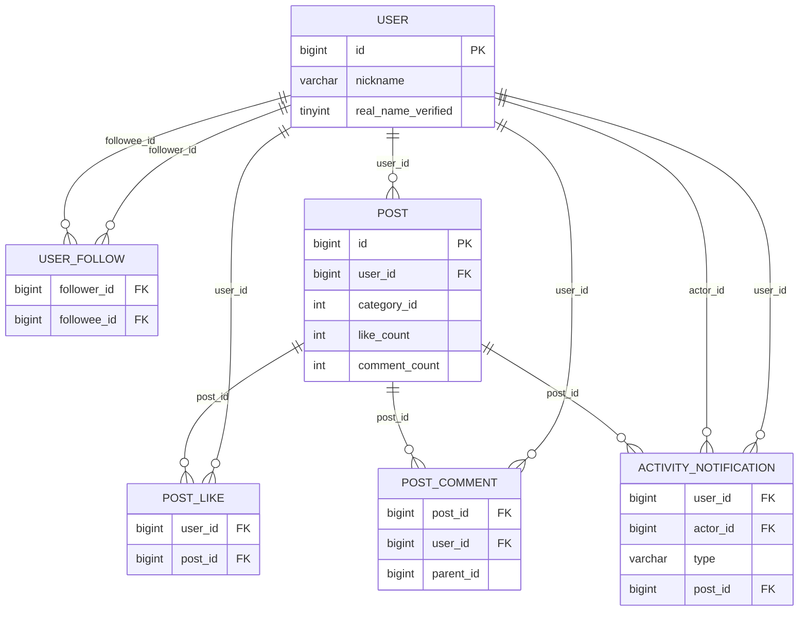
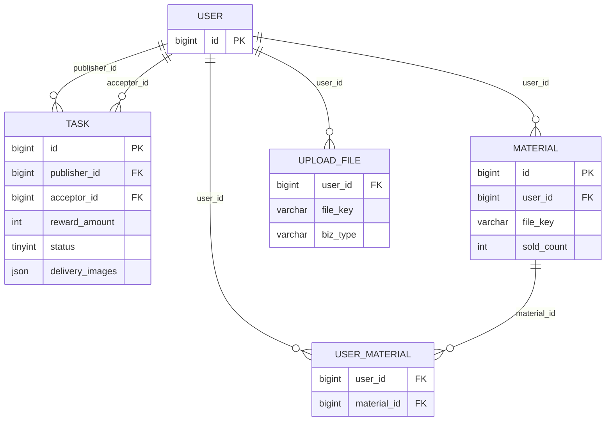
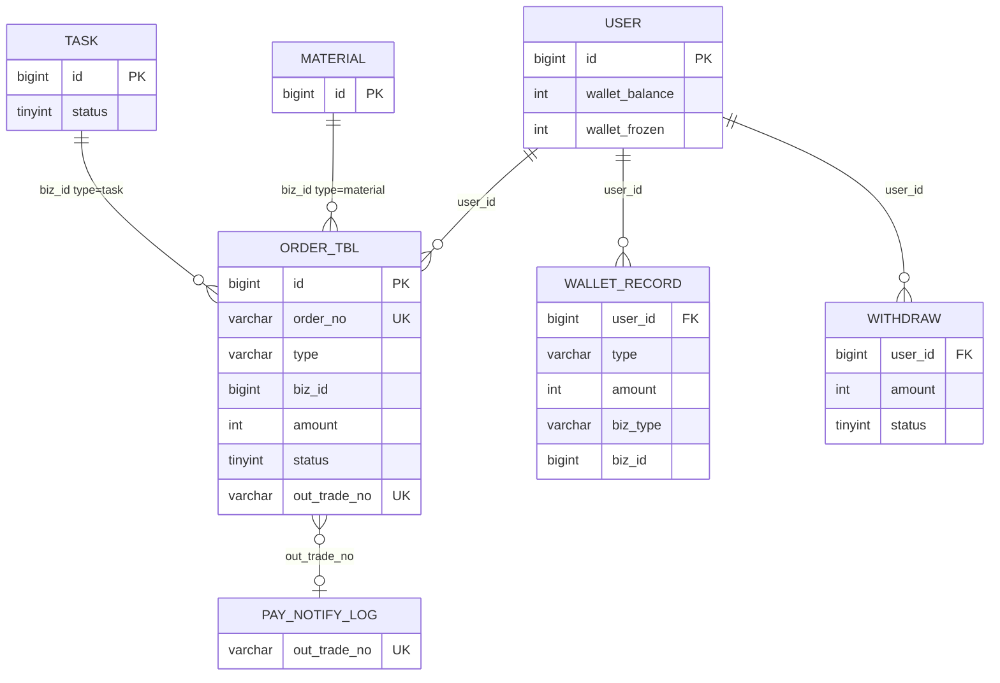
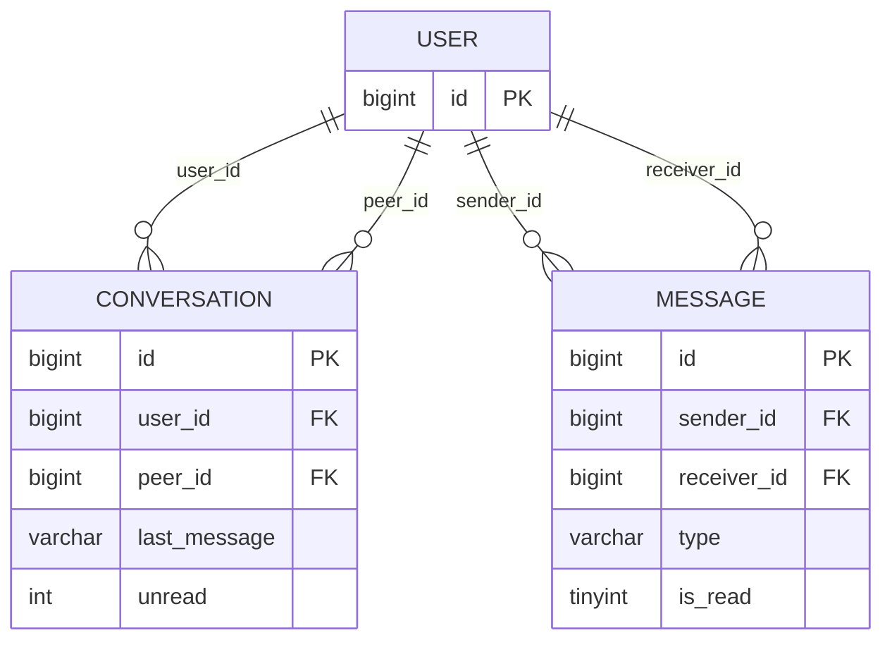
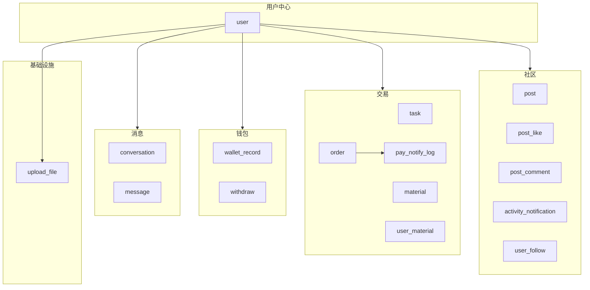

# SchoolShop 数据库 ER 图

> 依据 [mysql.md](./mysql.md) 绘制。在 VS Code / GitHub / Cursor 中预览本文件即可渲染 Mermaid 图。  
> `order.biz_id` 为多态关联：`type=task` 时指向 `task.id`，`type=material` 时指向 `material.id`（库表未建物理外键，由应用层保证）。

---

## 1. 总览（16 表）

---

## 2. 用户与社交

---

## 3. 代办悬赏与资料集市

---

## 4. 订单、支付与钱包

**说明**

- 创建任务 / 购买资料时各写入一条 `ORDER_TBL`（`status=0`）。
- 微信支付回调验签后写 `PAY_NOTIFY_LOG`，再更新 `ORDER_TBL` 与 `task` / `user_material`。
- 任务验收完成后，`WALLET_RECORD` 给接单人入账（`biz_type=task`）。

---

## 5. 私信

**说明**：每对用户维护两条 `CONVERSATION`（分别以各自为 `user_id`）；发消息时更新双方会话摘要并插入 `MESSAGE`。

---

## 6. 关系速查

| 关系 | 类型 | 说明 |
|------|------|------|
| user ↔ user_follow | 1:N（自关联） | 关注者 / 被关注者均指向 user |
| user → post | 1:N | 发帖 |
| post ↔ post_like | 1:N | UK(user_id, post_id) |
| post ↔ post_comment | 1:N | 评论，parent_id 预留回复 |
| user → task | 1:N | publisher；acceptor 可空 |
| user → material | 1:N | 卖家上架 |
| user ↔ material | N:M | 经 user_material 表示已购 |
| user → order | 1:N | 统一订单 |
| order → task / material | N:1（多态） | 由 type + biz_id 区分 |
| order ↔ pay_notify_log | 1:1（逻辑） | out_trade_no 幂等 |
| user → wallet_record / withdraw | 1:N | 流水与提现 |
| user → activity_notification | 1:N | 接收方 user_id；触发方 actor_id |
| user ↔ conversation | 1:N | 每对用户两条会话记录 |
| user ↔ message | 1:N | 发送方 / 接收方 |

---

## 7. 模块划分（逻辑视图）

